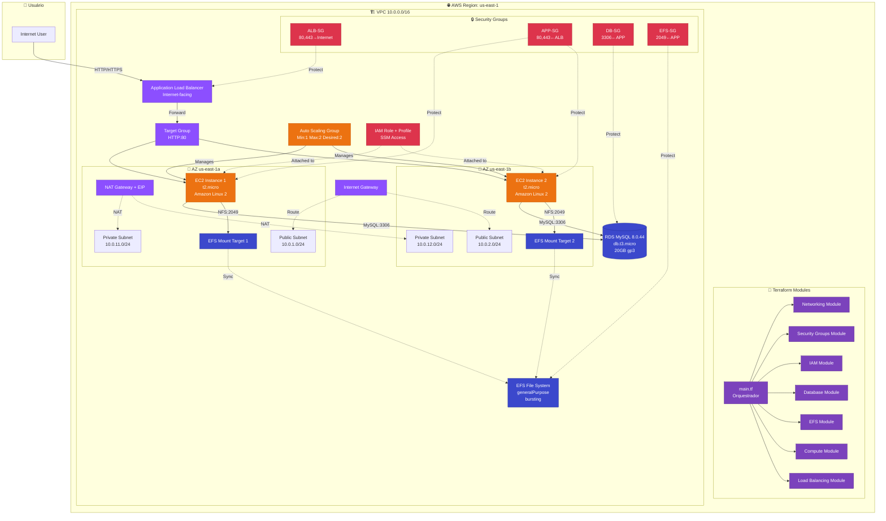

# WordPress na AWS: ClickOps vs Infrastructure as Code (Terraform)

## 🎯 Sobre Este Projeto

Este projeto demonstra a **transição de infraestrutura manual (ClickOps) para Infrastructure as Code (IaC)** usando Terraform, através da implementação da mesma arquitetura WordPress escalável na AWS.

### Objetivo
Comparar de forma objetiva e prática duas abordagens:
- ☁️ **ClickOps**: Configuração manual via AWS Console
- 🔧 **Terraform**: Automação completa via código

---

## 📚 Documentação

### 🚀 Por Onde Começar?

1. **[RESUMO-EXECUTIVO.md](RESUMO-EXECUTIVO.md)** - Leia primeiro! Visão geral completa
2. **[PLANEJAMENTO.md](PLANEJAMENTO.md)** - Planejamento estratégico e roadmap
3. **[CHECKLIST-COMPLETO.md](CHECKLIST-COMPLETO.md)** - Checklist executável detalhado
4. **[GUIA-RAPIDO.md](GUIA-RAPIDO.md)** - Comandos práticos
5. **[EXEMPLO-MODULO-TERRAFORM.md](EXEMPLO-MODULO-TERRAFORM.md)** - Código Terraform
6. **[COMPARACAO-TEMPLATE.md](COMPARACAO-TEMPLATE.md)** - Template de análise
7. **[INDICE.md](INDICE.md)** - Índice completo

---

## **Arquitetura**

### 📊 Diagrama da Infraestrutura (Terraform IaC)



### 🔄 ClickOps vs Terraform

| Aspecto | ClickOps (Manual) | Terraform (IaC) |
|---------|-------------------|-----------------|
| **Diagrama Original** |  | Diagrama Mermaid acima |
| **Método** | Console AWS (cliques) | Código declarativo |
| **Tempo de Deploy** | ~45-60 minutos | ~10-15 minutos |
| **Reprodutibilidade** | ❌ Manual, sujeito a erros | ✅ Automatizado e consistente |
| **Documentação** | ❌ Screenshots e anotações | ✅ Código autodocumentado |
| **Versionamento** | ❌ Não versionável | ✅ Git history completo |
| **Rollback** | ❌ Manual e arriscado | ✅ `terraform destroy` |
| **Módulos** | ❌ N/A | ✅ 7 módulos reutilizáveis |

---

## 🏗️ Arquitetura a Ser Implementada

### Visão Geral
VPC → Subnets → Security Groups → RDS + EFS → EC2 Auto Scaling → ALB

### 📦 Componentes Provisionados na AWS

#### 1. **Networking**
- **VPC** customizada (10.0.0.0/16) com DNS habilitado
- **2 Subnets públicas** (10.0.1.0/24 e 10.0.2.0/24) em 2 AZs (us-east-1a, us-east-1b)
- **2 Subnets privadas** (10.0.11.0/24 e 10.0.12.0/24) em 2 AZs
- **Internet Gateway** para acesso público
- **1 Elastic IP** para NAT Gateway
- **1 NAT Gateway** (em subnet pública na AZ us-east-1a)
- **Route Tables**:
  - 1 Route Table pública (rota para Internet Gateway)
  - 2 Route Tables privadas (rotas para NAT Gateway)

#### 2. **Security Groups**
- **ApplicationLoadBalancer-SG**: 
  - Ingress: HTTP (80) e HTTPS (443) de 0.0.0.0/0
  - Egress: HTTP (80) e HTTPS (443) para ApplicationServer-SG
- **ApplicationServer-SG**: 
  - Ingress: HTTP (80) e HTTPS (443) do ALB-SG
  - Egress: MySQL (3306) para Database-SG, NFS (2049) para EFS-SG, HTTPS (443) para internet
- **Database-SG**: 
  - Ingress: MySQL (3306) de ApplicationServer-SG
- **EFS-SG**: 
  - Ingress: NFS (2049) de ApplicationServer-SG e de si mesmo
  - Egress: Todo tráfego

#### 3. **Database (RDS)**
- **Engine**: MySQL 8.0.44
- **Instance class**: db.t3.micro
- **Storage**: 20 GB SSD gp3 (com auto scaling até 50 GB)
- **Encryption**: Desabilitado
- **Multi-AZ**: Não (single AZ)
- **Backup**: Desabilitado (retention period = 0)
- **Publicly accessible**: Não
- **DB Subnet Group**: nas 2 subnets privadas
- **Skip final snapshot**: Sim

#### 4. **Storage (EFS)**
- **EFS File System** (Elastic File System)
- **Performance mode**: generalPurpose
- **Throughput mode**: bursting
- **Encryption**: Desabilitado
- **Lifecycle policy**: Transição para IA após 30 dias
- **2 Mount targets**: 1 em cada subnet privada (2 AZs)

#### 5. **Compute (EC2)**
- **Launch Template** com:
  - **AMI**: Amazon Linux 2 (última versão)
  - **Instance type**: t2.micro
  - **Monitoring**: Habilitado
  - **IAM Instance Profile**: Para SSM access
  - **User Data** com instalação automática de:
    - Docker
    - Docker Compose (v2.32.4)
    - NFS utils
    - SSM Agent
    - Montagem automática do EFS em `/mnt/efs/wordpress`
    - Container WordPress via Docker Compose

#### 6. **Load Balancing & Auto Scaling**
- **Application Load Balancer**:
  - Tipo: application
  - Scheme: internet-facing
  - Subnets: 2 públicas
  - HTTP2: Habilitado
  - Deletion protection: Desabilitado
  
- **Target Group**:
  - Protocolo: HTTP porta 80
  - Health check: path `/`, threshold 2/2, interval 30s, timeout 5s
  - Deregistration delay: 30s
  
- **Listener**: HTTP porta 80 (forward para Target Group)

- **Auto Scaling Group**:
  - **Desired capacity**: 2
  - **Min**: 1
  - **Max**: 2
  - **Subnets**: 2 privadas
  - **Health check type**: ELB
  - **Grace period**: 300s (5 minutos)
  - **Métricas habilitadas**: Desired, InService, Min, Max

#### 7. **IAM**
- **IAM Role**: `wordpress-ec2-ssm-role`
  - Trust policy para ec2.amazonaws.com
- **IAM Policy**: `AmazonSSMManagedInstanceCore` (managed AWS policy)
- **Instance Profile**: Para anexar role às instâncias EC2

### 🚀 Fluxo do Deploy

Quando você executa `./deploy.sh`, o script realiza 6 etapas:

1. **Terraform Init**: Inicializa backend e baixa providers
2. **Terraform Validate**: Valida sintaxe e configuração
3. **Terraform Fmt**: Formata código recursivamente
4. **Terraform Plan**: Cria plano de execução (salvo em `tfplan`)
5. **Confirmação Manual**: Aguarda você digitar "sim" para prosseguir
6. **Terraform Apply**: Cria todos os recursos (~10-15 minutos)

Ao final, você receberá:
- URL do WordPress (via ALB)
- IDs de todos os recursos criados
- Arquivo `deployment-info.txt` com resumo completo

### 💰 Detalhamento de Custos (USD/dia)

| Recurso | Custo Estimado | Observações |
|---------|----------------|-------------|
| NAT Gateway | ~$1.00/dia | Componente mais caro |
| ALB | ~$0.50/dia | Load balancer |
| EC2 t2.micro (2x) | Free tier ou ~$0.25/dia | Elegível para free tier |
| RDS t3.micro | Free tier ou ~$0.50/dia | Elegível para free tier |
| EFS | ~$0.10-0.20/dia | Baseado em uso |
| Transferência | Variável | Depende do tráfego |

**Total estimado**: $2-3/dia durante testes

⚠️ **IMPORTANTE**: Configure billing alerts e execute `./destroy.sh` quando não estiver usando!

---

## 📂 Estrutura

```
.
├── clickops/              # Guia ClickOps manual
├── terraform/             # Código IaC
│   ├── modules/          # 7 módulos Terraform
│   └── environments/     # dev/prod
├── ansible/              # Playbook original
├── docs/                 # Documentação adicional
└── *.md                  # Guias e planejamento
```

---

